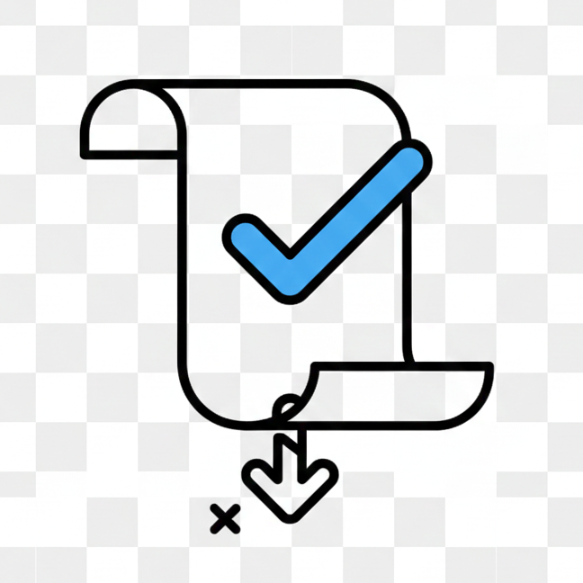
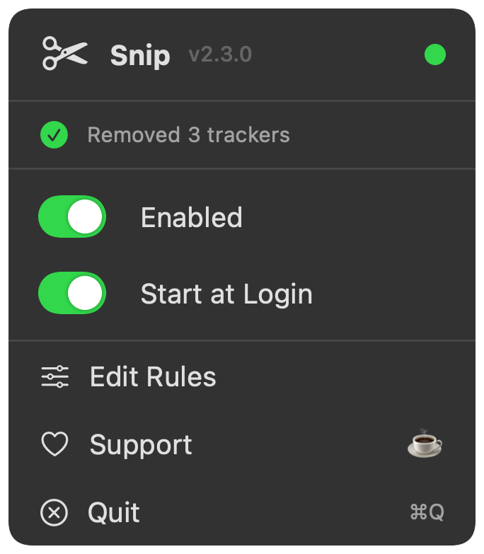

<div align="center">
<h1>✂️ Snip</h1>



<p>Automatically strip tracking junk from URLs when you copy them</p>
</div>

---

<p align="center">
  
</p>

## Why?

Every link you share is full of tracking garbage. `utm_source`, `fbclid`, `gclid` — they let companies track where you came from and follow you around the web.

Snip removes them automatically. Copy a link, share a clean link.

You copy `https://example.com/article?utm_source=twitter&utm_medium=social&fbclid=abc123`

Your clipboard gets `https://example.com/article`

No action needed. Just copy links like normal.

## Install

**Homebrew** (recommended):
```bash
brew tap maferland/tap
brew install --cask snip
```

**Manual**: Download DMG from [Releases](https://github.com/maferland/snip/releases), open it, drag `Snip.app` to Applications.

**Build from source**:
```bash
git clone https://github.com/maferland/snip.git
cd snip
make install
```

## Usage

Run `Snip`. A link icon appears in your menu bar. That's it.

- **Enabled/Disabled** — Toggle cleaning on/off
- **Start at Login** — Run automatically when you log in
- **Edit Rules** — Customize which tracking params get stripped
- **Quit** — Stop the app

## What Gets Removed

| Tracker | Source |
|---------|--------|
| `utm_*` | Google Analytics |
| `fbclid` | Facebook |
| `gclid`, `dclid` | Google Ads |
| `msclkid` | Microsoft/Bing |
| `twclid` | Twitter/X |
| `si` | Spotify |
| `igshid` | Instagram |
| `mc_eid`, `mc_cid` | Mailchimp |
| `_hsenc`, `_hsmi` | HubSpot |
| `ref`, `ref_src` | Generic referral |
| `s`, `t` | X/Twitter (domain-scoped) |
| `pd_rd_*`, `pf_rd_*` | Amazon (domain-scoped) |
| `_encoding`, `th`, `psc` | Amazon (domain-scoped) |

[Full list in source](Snip/TrackingParamsConfig.swift) — customizable via Edit Rules

## Privacy

Snip runs entirely on your Mac. No network requests. No data collection. No analytics (ironic, right?).

## Requirements

- macOS 14 (Sonoma) or later
- ~5MB disk space

## Support

If Snip saves you from tracking junk, consider buying me a coffee:

[](https://buymeacoffee.com/maferland)

## Contributing

See [CONTRIBUTING.md](CONTRIBUTING.md) for guidelines.

## License

MIT — see [LICENSE](LICENSE)
